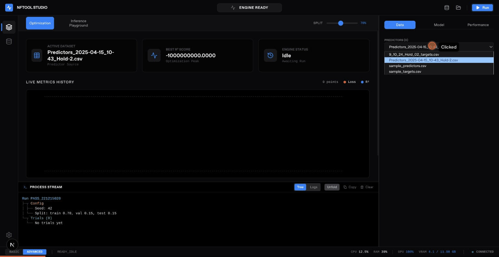

# NFTool

Deep learning tool for modular regression analysis and training.

Quick start:
`npm run tauri:dev`

Visit: `http://localhost:3000` (frontend) and `http://localhost:8001` (backend)

Local workflow:
- `npm --prefix frontend run lint`
- `npm --prefix frontend run build`
- `python -m pytest backend/tests`
- `python -m pylint backend/src`

The Tauri dev server starts both the frontend and backend sidecar for local development.

## End-to-end tests (Playwright)

Prerequisites:
- Backend running at `http://localhost:8001` (e.g., `python backend/src/api.py`).
- Sample datasets are available under `data/` (`sample_predictors.csv`, `sample_targets.csv`).
- If you enable API keys, ensure `API_KEY` for the backend matches
  `NEXT_PUBLIC_API_KEY` for the frontend (default `nftool-dev-key`).

Run:
- `npx --prefix frontend playwright test`

Troubleshooting:
- If tests fail with 406 responses, verify the API key env vars match the backend and frontend.
- If the UI remains stuck on CONNECTING, confirm the backend is running on port 8001.
- Dataset preview failures usually indicate an incorrect dataset path or missing CSV files in `data/`.
